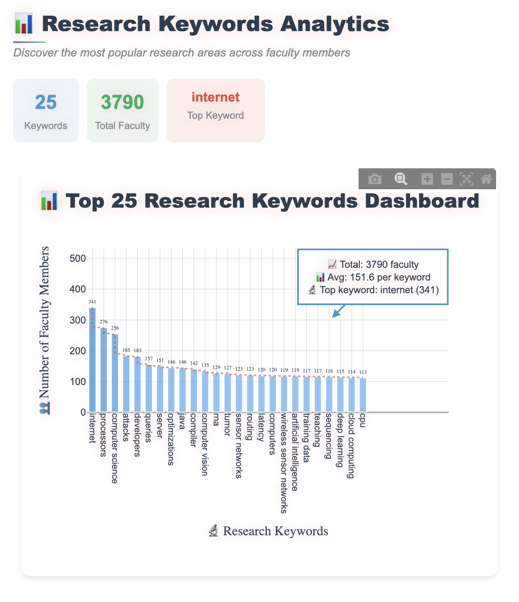
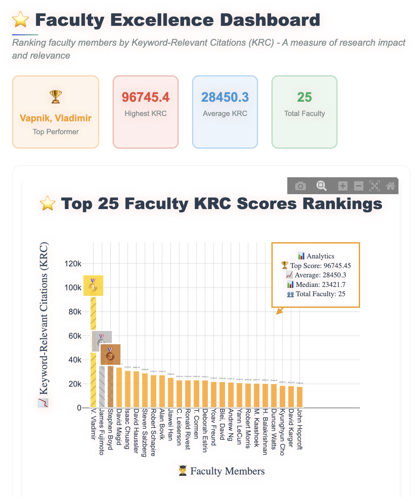
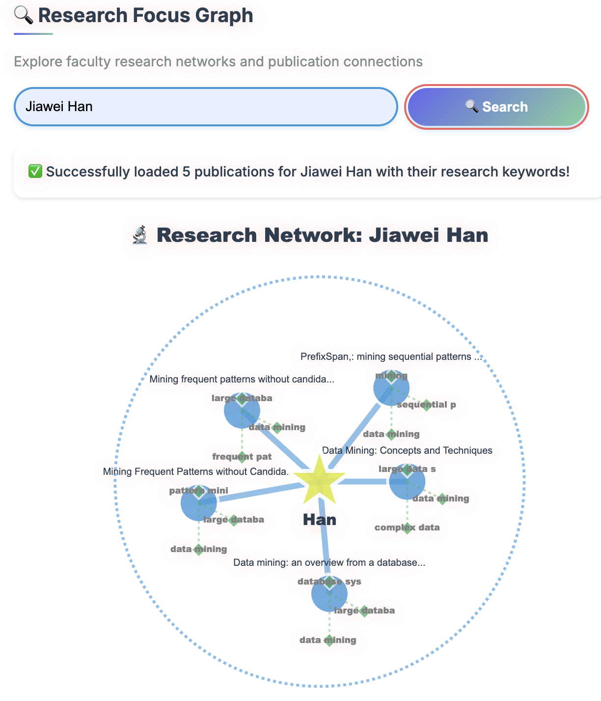
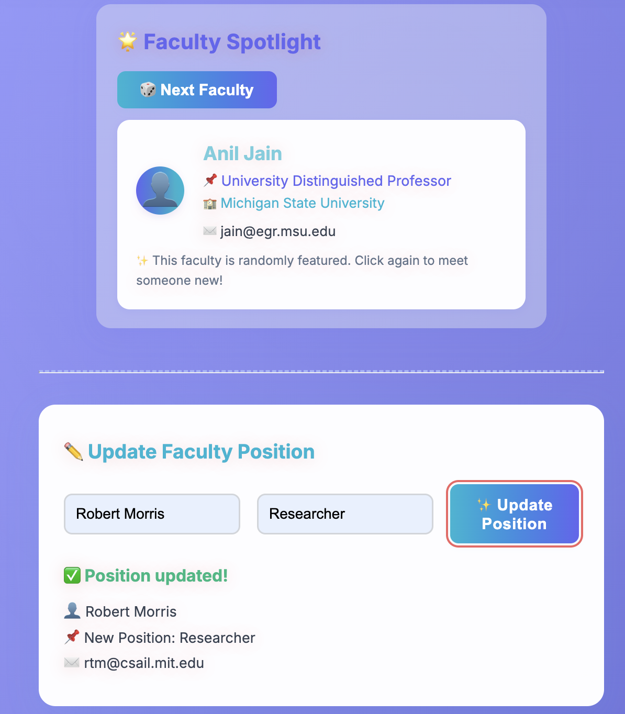
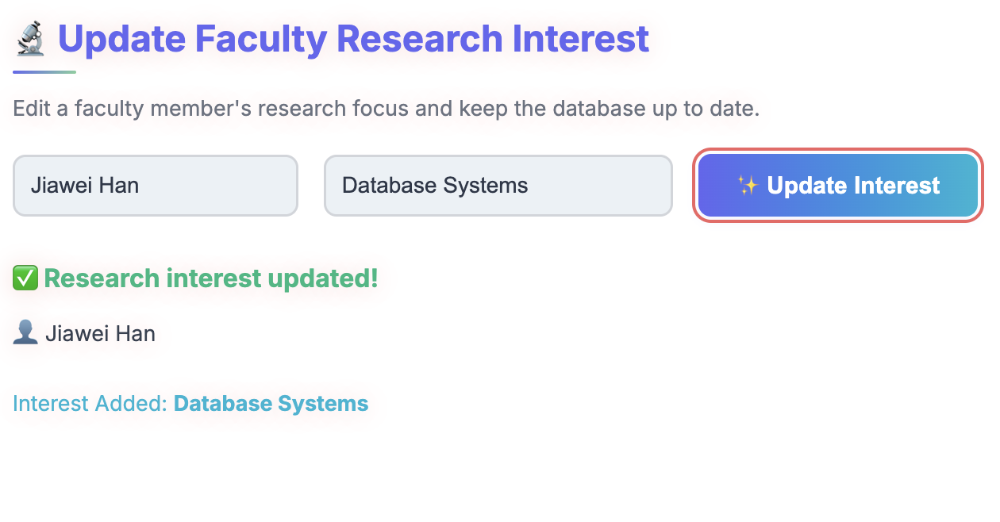
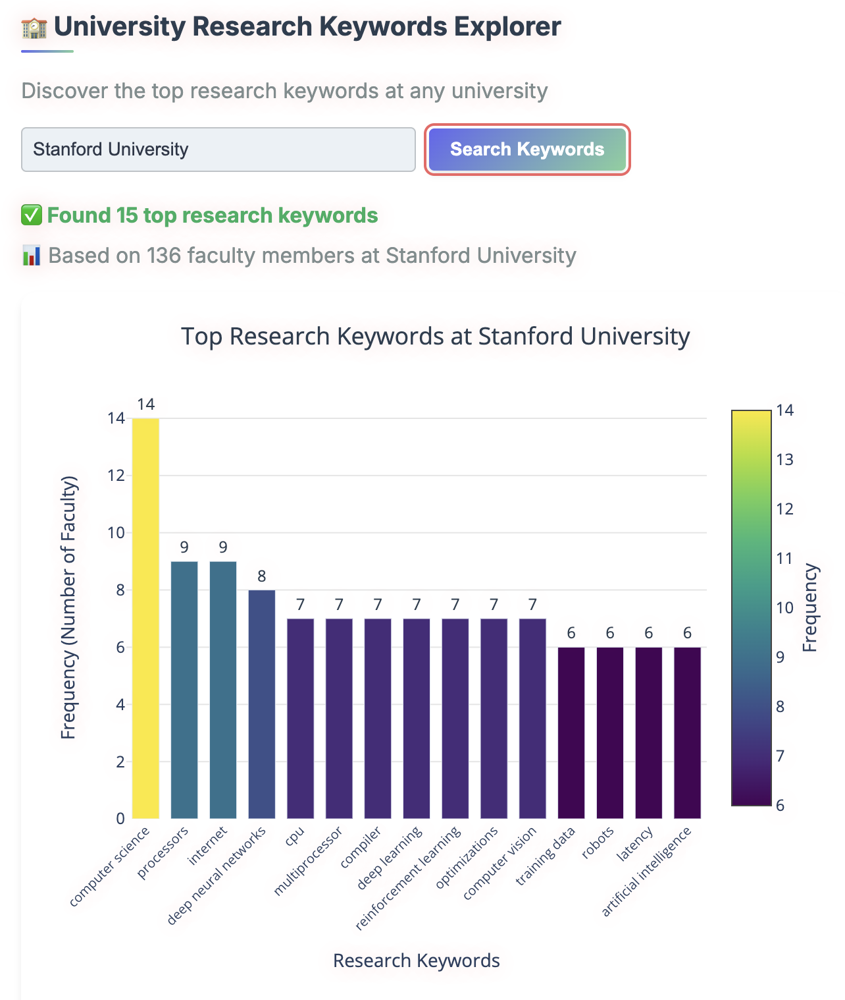
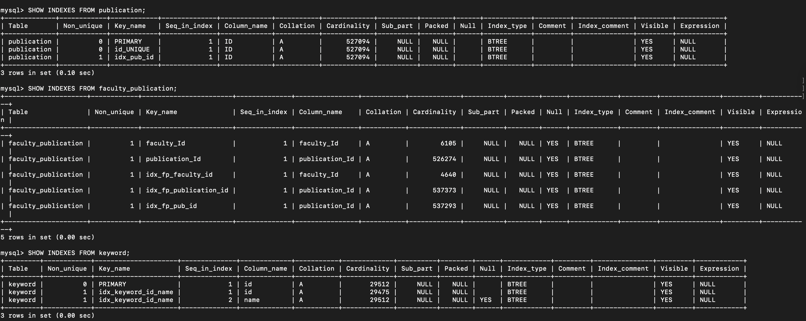
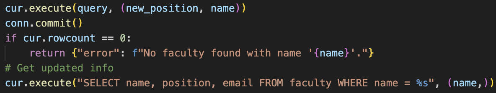
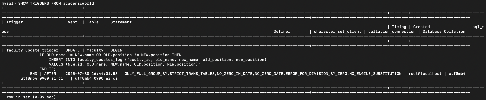

# 📚 Academic World Dashboard
---
### ⚠️ Demo Mode (No Dataset Loaded)

The live demo below runs **without the Academic World dataset** because the dataset 
cannot be uploaded or publicly hosted (MySQL / MongoDB / Neo4j).

The Render deployment shows the **UI only**.  
For full functionality, please run the project locally with your own copy of the dataset.

🔗 **Live Demo:** https://academic-dashboard-bi8h.onrender.com/
## Overview

This application is an interactive web dashboard for exploring, querying, and updating the **Academic World** dataset. It seamlessly integrates **MySQL**, **MongoDB**, and **Neo4j** as backend databases, allowing users to discover key researchers, publications, and collaborations across universities.

---

## 🚀 Purpose

- **Scenario:** Academic researchers, students, and administrators seeking to analyze research output, faculty collaborations, and academic trends across top universities.
- **Target Users:** Researchers, students, university administrators, and anyone interested in academic data analytics.
- **Objectives:**
  - Discover influential faculty and their research.
  - Visualize university and faculty rankings.
  - Update faculty information directly from the dashboard.
  - Explore co-authorship and research networks.

---


## 🛠 Installation

1. **Clone the repository:**
   ```bash
   git clone https://github.com/CS411DSO-SU25/IanW.git
   cd IanW
   ```
2. **Install Python dependencies:**
   ```bash
   pip install -r requirements.txt
   ```
3. **Ensure MySQL, MongoDB, and Neo4j are running with the Academic World dataset loaded.**

4. **Start the dashboard:**
   ```bash
   python app.py
   ```
5. Open [http://localhost:8050](http://localhost:8050) in your browser.

---

## 🖱️ Usage Instructions

- Use dropdowns to filter by keyword, faculty, and university.
- Each widget dynamically updates based on the selected filters.
- Click the **Clear** button to reset all filters.
- Authorized users can edit faculty profiles; updates propagate to all databases automatically.
- A MySQL trigger logs every update made to faculty name or position.

---

## 🧩 Widget Descriptions

- **🔹 Widget 1: Research Keywords Analytics (MongoDB)**  
  **What:** Displays  top 25 popular keywords across academic world.  
  **Why:** Helps users identify which research keywords are widely used.  
  **How:** Aggregates keyword frequencies via MongoDB pipelines and ranks by keyword popularity.
  

- **🔹 Widget 2: Faculty Excellence Dashboard (MySQL)**  
  **What:** Visualizes faculty research output using Keyword-Relevant Citation (KRC) as a measure of excellence.  
  **Why:** Assesses faculty performance based on topic relevance and impact.  
  **How:** SQL queries compute KRC scores and group publication data by year; output is rendered using Plotly.
    

- **🔹 Widget 3: Research Focus Graph (Neo4j)**  
  *Explore research structure: Faculty → Top 5 Publications → Top 3 Keywords per publication*  
  **What:** Interactive network graph showing a faculty member’s key publications and associated topics.  
  **Why:** Highlights both the depth and diversity of a faculty member's research portfolio.  
  **How:** Neo4j Cypher queries extract top publications and keywords, forming a visual research graph.
    

- **🔹 Widget 4: Faculty Spotlight**  
  *🎲 Randomly highlights a professor from the dataset*  
  *✏️ Update Faculty Position (MySQL)*  
  **What:** Randomly showcases a faculty profile and enables position editing.  
  **Update:** Faculty (required), Position (input required)  
  **Why:** Engages users by surfacing diverse profiles and supports updating faculty positions.  
  **How:** MySQL query fetches a random faculty entry; update writes to MySQL and propagates to MongoDB and Neo4j via a trigger.
    

- **🔹 Widget 5: Update Faculty Research Interest**  
  *Faculty Name → New Research Interest → ✨ Update Interest*  
  **What:** Edits a faculty member’s research focus in real-time.  
  **Why:** Keeps research interest data relevant and current.  
  **How:** MySQL update command modifies faculty interests, synced across data stores as needed.
    

- **🔹 Widget 6: University’s Top 15 Keywords (MongoDB)**  
  **What:** Bar chart of the top 15 most frequent research keywords at a selected university.  
  **Why:** Identifies each university’s main research strengths.  
  **How:** MongoDB aggregation pipeline ranks keyword usage based on faculty profiles at the chosen institution.
    

---

---

## 🗃️ Database Techniques Used

This project successfully implements four advanced database techniques:

1. **Indexing**  
   Indexes are automatically created through the use of `PRIMARY KEY`, `FOREIGN KEY`, and `UNIQUE` constraints in the MySQL schema. These indexes help improve query performance, especially in joins and filters used across faculty, keyword, and publication tables.
   ### ⚡️ Indexes Used

1.1. **publication**
   - `PRIMARY` (on `ID`)
   - `id_UNIQUE` (unique index on `ID`)
   - `idx_pub_id` (custom BTREE index)

1.2. **faculty_publication**
   - `faculty_Id`, `publication_Id`
   - Custom indexes: `idx_fp_faculty_id`, `idx_fp_publication_id`, `idx_fp_pub_id`

1.3. **keyword**
   - `PRIMARY` (on `id`)
   - Composite index: `idx_keyword_id_name (id, name)`
  

2. **Prepared Statements**
All MySQL queries that interact with user input use parameterized SQL queries via Python's pymysql library, ensuring query safety and efficiency.
Example:
  - `query = "UPDATE faculty SET position = %s WHERE name = %s"
     cur.execute(query, (new_position, name))`
      
3. **Trigger Implemented**

**Trigger Name:** `faculty_update_trigger`  
**Table Affected:** `faculty`  
**Event:** `AFTER UPDATE`  
**Description:**  
This trigger logs updates to a faculty member's `name` or `position`.  
If either field changes, an entry is added to `faculty_updates_log`.

**Trigger SQL:**
```sql
CREATE TRIGGER faculty_update_trigger
AFTER UPDATE ON faculty
FOR EACH ROW
BEGIN
    IF OLD.name != NEW.name OR OLD.position != NEW.position THEN
        INSERT INTO faculty_updates_log (faculty_id, old_name, new_name, old_position, new_position)
        VALUES (NEW.id, OLD.name, NEW.name, OLD.position, NEW.position);
    END IF;
END;
```
  

This implementation completes the R13–R15 requirements by using **Indexing**, **Prepared Statements**, and **Trigger**.

---


## 🏗️ Architecture & Design

- **Frontend:** Built with Dash (Plotly) for interactive web visualization.
- **Layout:** Modular widget files (`widget1–widget6`) registered in `app.py`.
- **Styling:** Modern UI with custom CSS (in `/assets`).
- **Backend:** Python helper modules handle database queries for each database.
- **Update Flow:**
  - User edits faculty info → update reflected in MySQL.
  - Trigger activates → logs change → update is synced to MongoDB and Neo4j.

---


## ⏱️ Development Time Estimate

| Task                      | Estimated Hours |
|---------------------------|-----------------|
| Database integration      | 10 hrs          |
| Widget design & queries   | 20 hrs          |
| UI/UX polish              | 6 hrs           |
| Faculty update sync logic | 2 hrs           |
| Documentation & Demo      | 2 hrs           |
| **Total**                 | **~40 hrs**     |
